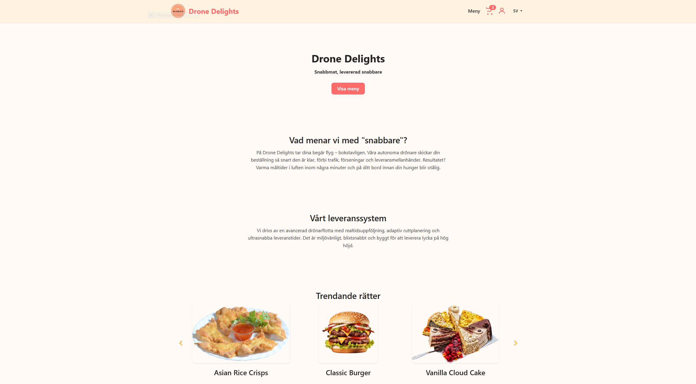
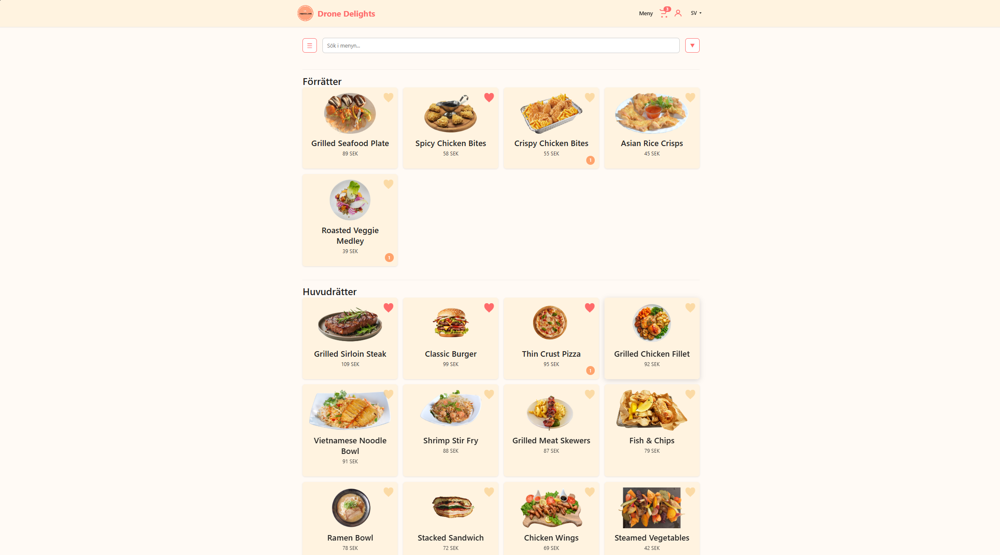
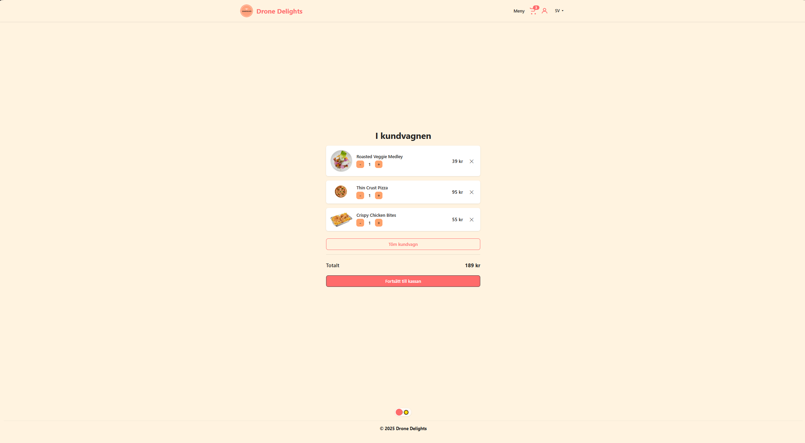
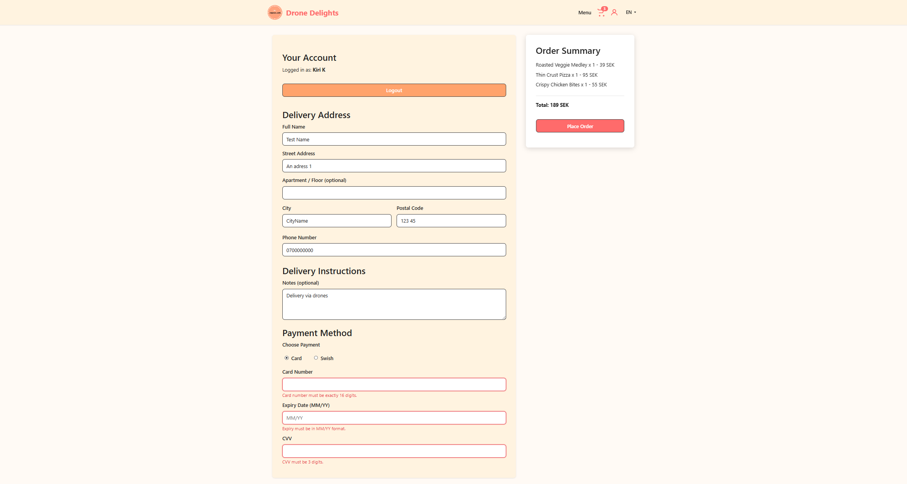
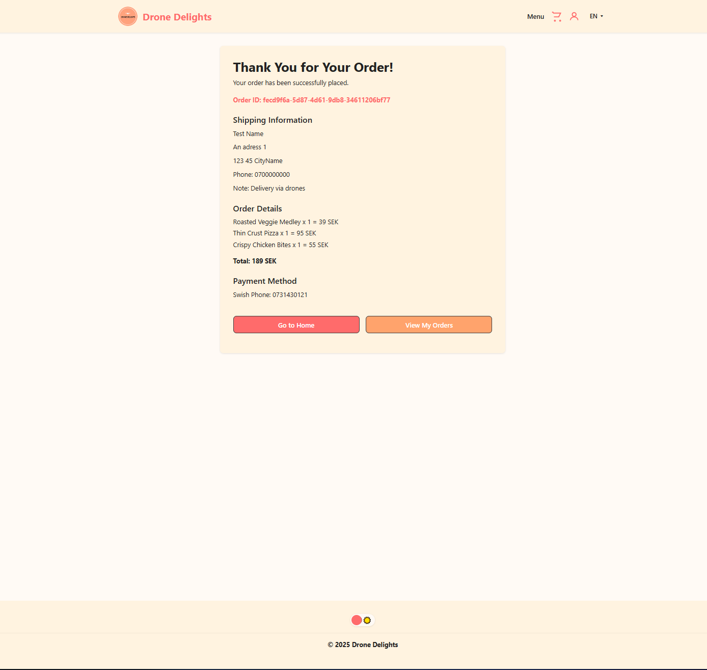

# Drone Delights – Food Delivery by Drone

This project was developed as part of the "Gränssnittsutveckling" course at Newton Yrkeshögskola (VT25), but it also serves as a portfolio piece to showcase my skills as a developer. It is a fullstack application simulating a modern food delivery service via drones, where users can explore the menu, place orders, and manage their profiles. The focus has been on building a complete user experience with a solid technical foundation.

## Getting Started

To start the application locally:

    npm install
    npm run dev

To start the JSON server for mock data:

    npm run server

## Purpose and Objectives

The purpose was to develop a user-friendly and responsive web application that exercises key skills such as frontend development with React, backend integration using json-server, UI/UX design in Figma, and project documentation. The app is designed to demonstrate my ability to work with modern technologies and follow industry best practices.

## Technologies and Architecture

The application is built in React 18 using React Router for page navigation. A json-server backend was implemented to mock endpoints for products, users, and orders. I utilized SCSS for modular styling and i18next for multi-language support (Swedish and English). The application is fully component-based with clear separation of concerns, and all code is written in modern ES6 modules using functional components.

Key technical choices:

- React Hooks for state and effects
- LocalStorage for cart, favorites, and session handling
- UUID for unique order IDs
- Figma for wireframes and design

## Functionality and Design Decisions

- Home page with hero section, call-to-action, and carousel for trending dishes
- Menu page with dynamic filtering (main courses, starters, drinks, desserts, favorites), search, and sorting
- Cart with dynamic updates and animations in the header
- Checkout page with extensive validation of names, addresses, phone numbers, and payment details (Swish and credit card)
- Login and registration with session management and basic authentication
- Profile page with the ability to update user details and password, and view order history
- Confirmation page with order summary and details

Special attention was given to user experience, with responsive design and accessibility features such as aria-labels and proper form handling.

## Challenges and Lessons Learned

Building a complete application like this has been both challenging and educational. Setting up json-server to simulate a real backend with user management required creativity, especially in handling session data and authentication. Implementing language switching with i18next was an additional feature I chose to include to give the app a more international feel. Keeping the cart state synchronized with localStorage and the UI taught me a lot about state management in React.

I also realized that in a larger project I would have preferred using TypeScript for stricter type safety, and potentially Redux for global state management. Additionally, I would have liked to add loading states and spinner components to further improve the user experience. With more time, I would have implemented a real backend with JWT for more secure authentication.

## Conclusion

This project demonstrates my ability to handle both frontend and backend development in a modern web application. I worked on user flows, design, database structure, session handling, and validation, and gained a deeper understanding of how to build a professional product from start to finish. The application is well-structured, responsive, and developed with a focus on both functionality and usability.

I look forward to building on this project and using the experience gained in future projects.

## Gallery

---

# Drone Delights – Matleverans med drönare (Svenska)

Det här projektet utvecklades som en del av kursen Gränssnittsutveckling (VT25) vid Newton Yrkeshögskola, men fungerar även som en portföljpjäs för att visa upp mina kunskaper som utvecklare. Applikationen är en fullstacklösning som simulerar en modern matleveranstjänst via drönare, där användare kan utforska menyn, lägga beställningar och hantera sin profil. Fokus har varit att bygga en komplett användarupplevelse med en stabil teknisk grund.

## Kom igång

För att starta applikationen lokalt:

    npm install
    npm run dev

För att starta JSON-servern för mock-data:

    npm run server

## Syfte och mål

Syftet var att utveckla en användarvänlig och responsiv webbapplikation som tränar viktiga färdigheter såsom frontendutveckling i React, backendintegration via json-server, UI/UX-design i Figma samt dokumentation av arbetsprocessen. Appen är utvecklad för att visa att jag kan arbeta med moderna teknologier och följa branschstandard.

## Teknologier och arkitektur

Applikationen är byggd i React 18 med React Router för navigering mellan sidor. För backend används json-server som mock-backend för produkter, användare och ordrar. Jag har använt SCSS för modulär styling och i18next för stöd för flera språk (svenska och engelska). Applikationen är helt komponentbaserad med tydlig uppdelning av ansvar, och all kod är skriven i moderna ES6-moduler med funktionella komponenter.

Exempel på tekniska val:

- React Hooks för state och effekter
- LocalStorage för varukorg, favoriter och sessionshantering
- UUID för unika order-ID:n
- Figma för wireframes och design

## Funktionalitet och designval

- Startsida med hero-sektion, call-to-action och carousel för trending-rätter
- Menysida med dynamisk filtrering (huvudrätter, förrätter, drycker, desserter, favoriter), sökfunktion och sortering
- Varukorg med dynamisk uppdatering och animation i header
- Checkout-sida med omfattande validering för namn, adress, telefonnummer och betaluppgifter (Swish och kontokort)
- Login och registrering med sessionshantering och grundläggande autentisering
- Profilsida med möjlighet att uppdatera personuppgifter och lösenord samt visa orderhistorik
- Bekräftelsesida med orderöversikt och sammanställning

Jag har lagt extra fokus på användarvänlighet, med responsiv design och tillgänglighet via exempelvis aria-labels och korrekt hantering av formulär.

## Utmaningar och lärdomar

Att bygga en så pass komplett applikation har varit utmanande men väldigt lärorikt. Att sätta upp json-server för att simulera en riktig backend med användarhantering krävde kreativitet, särskilt kring sessionshantering och autentisering. Att implementera språkväxling med i18next var en extra funktionalitet som jag valde att lägga till för att ge appen en mer internationell känsla. Att hålla varukorgen i synk med localStorage och UI var också en nyttig övning i state-hantering i React.

Jag insåg också att jag gärna hade använt TypeScript för bättre typkontroll och kanske Redux för global state management i ett större projekt. Dessutom hade jag velat lägga till loading states och spinner-komponenter för att ytterligare förbättra användarupplevelsen. Med mer tid hade jag även velat implementera en riktig backend med JWT för säkrare autentisering.

## Slutsats

Projektet visar att jag kan hantera både frontend och backend i en modern webbapplikation. Jag har arbetat med användarflöden, design, databasstruktur, sessionshantering och validering och fått en djupare förståelse för hur man bygger en professionell produkt från start till mål. Applikationen är välstrukturerad, responsiv och utvecklad med fokus på både funktionalitet och användarvänlighet.

Jag ser fram emot att bygga vidare på projektet och använda erfarenheterna i kommande uppdrag.
